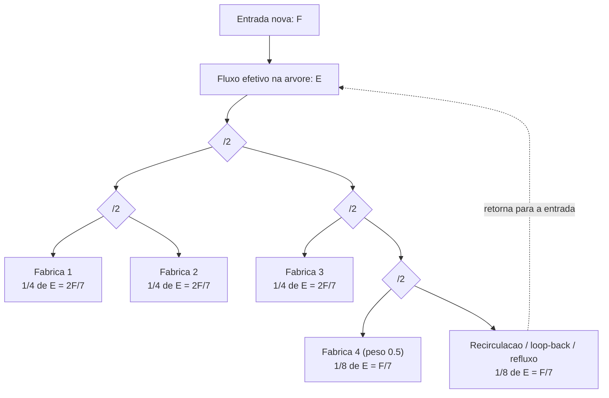

# Cenario: 4 fabricas com pesos 1, 1, 1 e 0.5

Este documento descreve um caso exato de **recirculacao**. Os termos **loop-back** e **refluxo** sao equivalentes aqui e significam a mesma saida retornando para a entrada do sistema.

## Objetivo

Distribuir o fluxo total entre 4 fabricas com pesos:

```text
1, 1, 1, 0.5
```

Normalizando para a menor razao inteira:

```text
1 : 1 : 1 : 0.5  ->  2 : 2 : 2 : 1
```

Logo, o sistema precisa entregar `7` partes uteis no total.

## Diagrama



## Construcao fisica correta

1. O primeiro andar divide a entrada por `2`.
2. O andar seguinte divide por `2` em ambas as saidas.
3. Isso produz `4` ramos de `1/4` do fluxo efetivo `E`.
4. Tres ramos de `1/4` alimentam diretamente as tres fabricas de peso `1`.
5. O quarto ramo de `1/4` e dividido por `2` novamente.
6. Um dos ramos de `1/8` vai para a fabrica de peso `0.5`.
7. O outro ramo de `1/8` retorna para a entrada.

## Logica do resultado

Definicoes:

- `F` = fluxo novo de entrada
- `E` = fluxo efetivo que percorre a arvore, ja somando o retorno

Como uma das `8` folhas finais retorna ao topo:

```text
Retorno = E/8
```

O fluxo novo e o fluxo efetivo menos a parte que foi devolvida:

```text
F = E - E/8
F = 7E/8
E = 8F/7
```

Com isso:

```text
1/4 de E = 2F/7
1/8 de E = F/7
```

Resultado final:

```text
Fabrica 1 = 2F/7
Fabrica 2 = 2F/7
Fabrica 3 = 2F/7
Fabrica 4 = F/7
```

Esse resultado equivale exatamente a:

```text
2 : 2 : 2 : 1
```

que e a forma inteira dos pesos:

```text
1 : 1 : 1 : 0.5
```

## Resultados aceitaveis

Para considerar um diagrama equivalente como correto, ele precisa preservar simultaneamente:

- tres saidas liquidas de `2F/7`
- uma saida liquida de `F/7`
- exatamente `1/8` do fluxo efetivo `E` retornando ao topo
- portanto, exatamente `F/7` de recirculacao em regime permanente

Em outras palavras, o diagrama pode mudar de desenho, mas nao pode mudar o resultado liquido abaixo:

```text
2/7, 2/7, 2/7, 1/7
```

## Observacao importante

O ramo que retorna nao representa perda. Ele existe para elevar o fluxo efetivo interno da arvore de `F` para `E = 8F/7`, permitindo que a topologia baseada em divisoes por `2` entregue exatamente a proporcao desejada.
